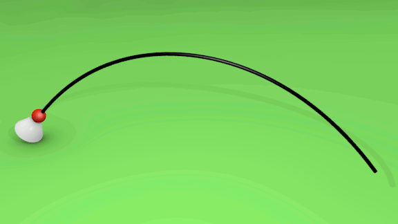

# Cinematica

::: {.callout-note collapse="true" appearance="minimal"}
## Cinematica 
La cinematica definisce le grandezze fisiche che permettono di descrivere il moto in modo quantitativo, senza occuparsi delle cause che lo producono.
:::

:::{.callout-note collapse="true" appearance="minimal"}
## Sistema di riferimento 
Si dice sistema di riferimento l'oggetto o l'insieme di oggetti rispetto al quale è definita la posizione di un corpo. |
:::

::: {.callout-note collapse="true" appearance="minimal"}
## Moto
Un corpo è in moto se la sua posizione varia nel tempo rispetto a un altro oggetto.
:::

::: {.callout-note collapse="true" appearance="minimal"}
## Traiettoria 
Una traiettoria è una linea continua formata dall'insieme di tutte le posizioni che un punto in movimento occupa in istanti successivi.

:::

::: {.callout-note collapse="true" appearance="minimal"}
## Moto rettilineo
Il moto di un punto materiale è rettilineo se la sua traiettoria giace su una linea retta.
:::

::: {.callout-note collapse="true" appearance="minimal"}
## Moto curvilineo
Il moto di un punto materiale è curvilineo se la sua traiettoria è una linea curva.
:::

::: {.callout-note collapse="true" appearance="minimal"}
## Moto unidimensionale
Il moto è **unidimensionale** quando per descriverlo è sufficiente
conoscere i valori assunti in funzione del tempo da **una sola variabile**.

Il moto rettilineo è unidimensionale perché la coordinata del punto materiale rispetto a una retta orientata è sufficiente a descrivere il moto.
:::

::: {.callout-note collapse="true" appearance="minimal"}
## Intervallo di tempo
L'intervallo di tempo tra due istanti successivi $t_1$, e $t_2$, è la quantità $\Delta t$ (si legge “delta ti”) data da:
$$\Delta t=t_2-t_1$$
:::

::: {.callout-note collapse="true" appearance="minimal"}
## Spostamento 
In un moto unidimensionale, lo spostamento dalla posizione $s_2$, alla posizione $s_1$, è la quantità $\Delta s$ data dalla variazione della coordinata:
$$\Delta s =s_2-s_1$$
In generale, lo spostamento è diverso dalla distanza percorsa.
:::

::: {.callout-important collapse="true" appearance="minimal"}
## Velocità media 
La velocità media $v_m$, in un intervallo di tempo $\Delta t$ è il rapporto tra lo spostamento $\Delta s$ nell'intervallo di tempo considerato e l'intervallo di tempo stesso:
$$v_m= \frac{\Delta s}{\Delta t}$$

$v_m$ velocità media (m/s) 
$\Delta s$ spostamento (m)
$\Delta t$ tempo impiegato (s)


La velocità nel SI si misura in metri al secondo (simbolo m/s).
:::

::: {.callout-note collapse="true" appearance="minimal"}
## Velocità istantanea 
La velocità istantanea $v$ in un istante $t$ è la velocità media calcolata in un intervallo di tempo $\Delta t$ infinitamente piccolo.
:::


::: {.callout-note collapse="true" appearance="minimal"}
## Legge oraria 
La legge oraria è la funzione che permette di conoscere la posizione del corpo in un certo istante.
:::


::: {.callout-note collapse="true" appearance="minimal"}
## Diagramma orario 
Si dice diagramma orario st, o grafico spazio-tempo, il grafico cartesiano della posizione in funzione del tempo.

:::{.panel-tabset}
### La velocità media 
Nell'intervallo di tempo tra due punti del grafico spazio-tempo la velocità media è uguale al coefficiente angolare della **retta secante** che li unisce.

### La velocità istantanea 
La velocità istantanea $v$ in un certo istante $t$ è il coefficiente angolare della **retta tangente** al diagramma orario nel punto di ascissa $t$. 
:::

:::

::: {.callout-note collapse="true" appearance="minimal"}
## Moto uniforme 
Si dice moto uniforme un moto in cui la velocità ha modulo costante.
:::

::: {.callout-note collapse="true" appearance="minimal"}
## Moto rettilineo uniforme 
Se, oltre ad avere velocità costante, il corpo percorre una traiettoria rettilinea si ha un moto rettilineo uniforme.
Lo spostamento $\Delta s$ compiuto in un moto rettilineo uniforme è direttamente  proporzionale al tempo $\Delta t$ impiegato a compierlo.

$$\frac{\Delta s}{\Delta t} = v$$ dove $v$ è una costante detta velocità (media o istantanea è sempre uguale).
:::

::: {.callout-important collapse="true" appearance="minimal"}
## Legge oraria del moto rettilineo uniforme  
Se assumiamo $t=0$ come istante a partire dal quale si inizia a misurare il tempo, la legge oraria del moto rettilineo uniforme è: 

:::{.panel-tabset}
### caso $s_0 \neq 0$
Se all'istante iniziale l'oggetto non è nell'origine, ma in $s_0 \neq 0$: 
$$s=s_0+vt$$


### caso $s_0 = 0$ 
Se all'istante iniziale l'oggetto è nell'origine: 
$$s=vt$$ 
:::

:::

::: {.callout-note collapse="true" appearance="minimal"}
## Diagramma orario del moto rettilineo uniforme  
Il diagramma orario è una retta: velocità media e velocità istantanea coincidono e sono rappresentate dalla pendenza della retta nel diagramma orario.

:::{.panel-tabset}
### caso $s_0 \neq 0$
Il diagramma orario è una retta che taglia l'asse s nel punto $s_0$.

```{ojs}
//| label: fig-mru0
//| fig-cap: "Grafico interattivo S-T. Passa il mouse sulla linea!"
//| echo: false

// 1. Generazione dei dati (come facevi con list e range in Python)
data_mru = {
  const t = Array.from({length: 11}, (_, i) => i);
  return t.map(i => ({
    tempo: i,
    posizione:  5 + 2 * i // s0 = 5, v = 2
  }));
}

// 2. Creazione del grafico (equivalente a px.line)
Plot.plot({
  grid: true,
  marks: [
    // La linea (linea continua)
    Plot.line(data_mru, {x: "tempo", y: "posizione", stroke: "steelblue", strokeWidth: 2}),
    // I punti (markers: true)
    Plot.dot(data_mru, {x: "tempo", y: "posizione", fill: "steelblue", r: 4}),
    // Il "passa il mouse" (tooltip interattivo)
    Plot.tip(data_mru, Plot.pointer({x: "tempo", y: "posizione"}))
  ],
  x: { label: "Tempo (s)" },
  y: { label: "Posizione (m)", domain: [0, 30] }
})
```

### caso $s = 0$ 
Il diagramma orario è una retta che taglia l'asse s nell'origine.

```{ojs}
//| label: fig-mru
//| fig-cap: "Grafico interattivo S-T. Passa il mouse sulla linea!"
//| echo: false

// 1. Generazione dei dati (come facevi con list e range in Python)
data_mru0 = {
  const t = Array.from({length: 11}, (_, i) => i);
  return t.map(i => ({
    tempo: i,
    posizione: 5 + 2 * i // s0 = 5, v = 2
  }));
}

// 2. Creazione del grafico (equivalente a px.line)
Plot.plot({
  grid: true,
  marks: [
    // La linea (linea continua)
    Plot.line(data_mru0, {x: "tempo", y: "posizione", stroke: "steelblue", strokeWidth: 2}),
    // I punti (markers: true)
    Plot.dot(data_mru, {x: "tempo", y: "posizione", fill: "steelblue", r: 4}),
    // Il "passa il mouse" (tooltip interattivo)
    Plot.tip(data_mru, Plot.pointer({x: "tempo", y: "posizione"}))
  ],
  x: { label: "Tempo (s)" },
  y: { label: "Posizione (m)", domain: [0, 30] }
})
```

:::
Per vedere i dati in azione, vai alla [Laboratorio virtuale](virtlab.qmd#fig-mruint).
:::


