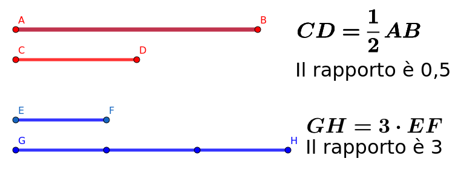
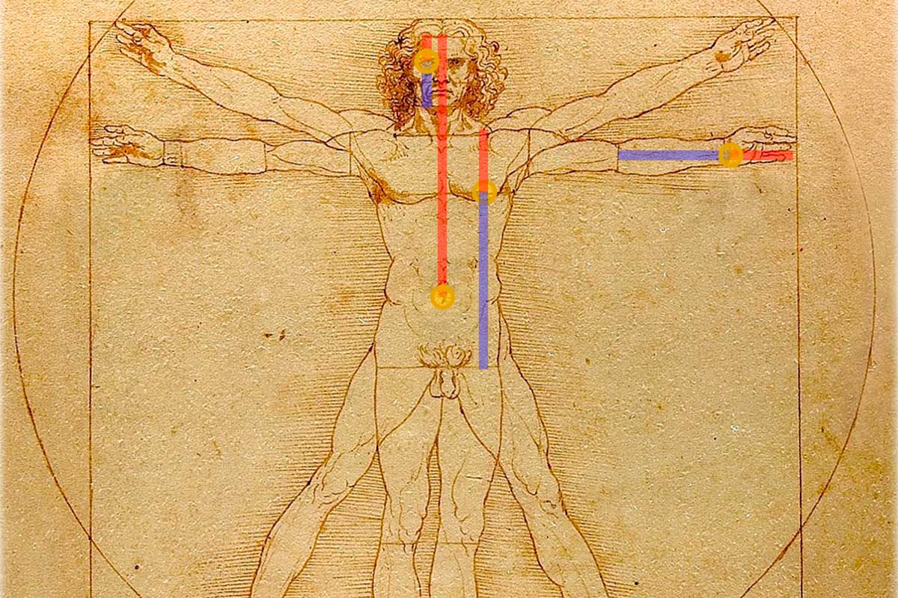
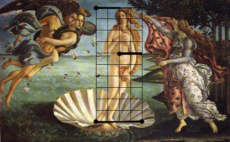
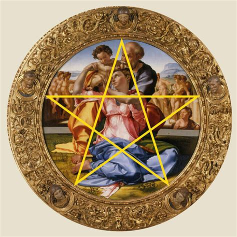
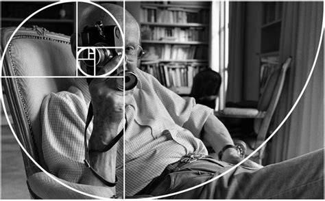
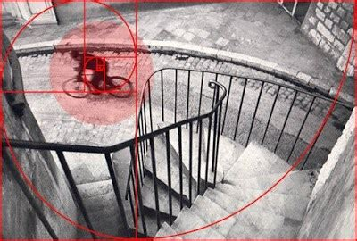
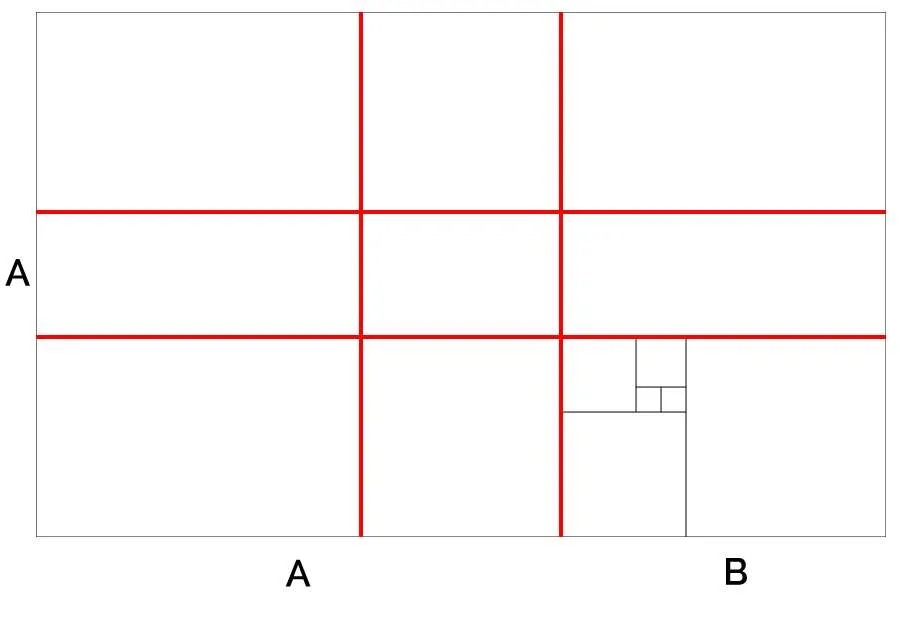

# Il Rapporto Aureo: La Formula della Bellezza 🌀

---

## Cos'è un "Rapporto"?
In matematica, un rapporto è semplicemente un **confronto tra due quantità o lunghezze**. 

Immagina di dividere un segmento in due parti: il rapporto ci dice quante volte una parte sta nell'altra o nell'intero.

È il modo in cui mettiamo in relazione le dimensioni di ciò che ci circonda.

{width="50%"}

---

## Il Rapporto Aureo: Il "Numero di Dio"
Il rapporto aureo è una proporzione speciale che l'occhio umano percepisce come **estremamente armoniosa e bella**.

-   Viene indicato con la lettera greca **Φ (phi)** e vale circa **1,618**.

-   Si trova ovunque: nelle conchiglie, nei petali dei fiori e persino nella forma delle galassie.

---

## Il video



Se non vedi il video [Clicca qui](https://www.youtube.com/watch?v=MWgsd3ot8gA&t=158s&end=269s)

---

## L'Equazione: Come si trova?
Nonostante il nome complicato, l'idea è semplice. 

Se hai un rettangolo, **a (il lato più lungo)** e **b (il lato più corto)** sono in rapporto aureo se ritagliando il quadrato di lato **b** si ottiene un rettangolo che ha lo stesso rapporto fra lato lungo e lato corto.

Quindi, se $\Phi=\frac{a}{b}$, allora $b = \Phi \cdot a$, ma anche $\frac{b}{b-a}=\Phi$. Si ottiene:

$$\Phi = \frac{b}{\Phi b-b} = \frac{\not b}{\not b(\Phi-1)}$$

## L'equazione

Quindi il rapporto aureo sarà il numero che otteniamo calcolando:

$$\phi=\frac{1}{\phi-1}$$

---

## Il Rinascimento: L'Arte della Proporzione
Gli artisti del Rinascimento erano ossessionati dall'equilibrio e usavano il rapporto aureo per rendere le loro opere "divine".

---

**Leonardo da Vinci:** Lo ha usato nell'*Uomo Vitruviano* per mostrare le proporzioni perfette del corpo umano.

{width="50%"}

---

**Sandro Botticelli:** Opere come la *Nascita di Venere* seguono questi schemi geometrici per trasmettere armonia.

{width="50%"}

---

**Michelangelo:** In capolavori come il *Tondo Doni*, la composizione è studiata per guidare l'occhio in modo naturale e bilanciato.

{width="50%"}

---

## 5. La Fotografia: Oltre la Regola dei Terzi
In fotografia, il rapporto aureo serve a comporre immagini più dinamiche e sofisticate rispetto alla solita "regola dei terzi".

---

**La Spirale Aurea:** Deriva dai numeri di Fibonacci e aiuta a posizionare il soggetto nel punto di massimo interesse, guidando lo sguardo lungo una curva naturale.

{width="50%"}

---

**L'Istante Decisivo:** Fotografi come Henri Cartier-Bresson usavano un "senso della geometria" istintivo per catturare momenti perfetti in cui tutto era in ordine.

{width="50%"}

***
## Fotografia

In fotografia la sezione aurea offre la possibilità di sotituire la "griglia" dei terzi con una griglia ancora più armoniosa all'occhio umano.

{width="50%"}

